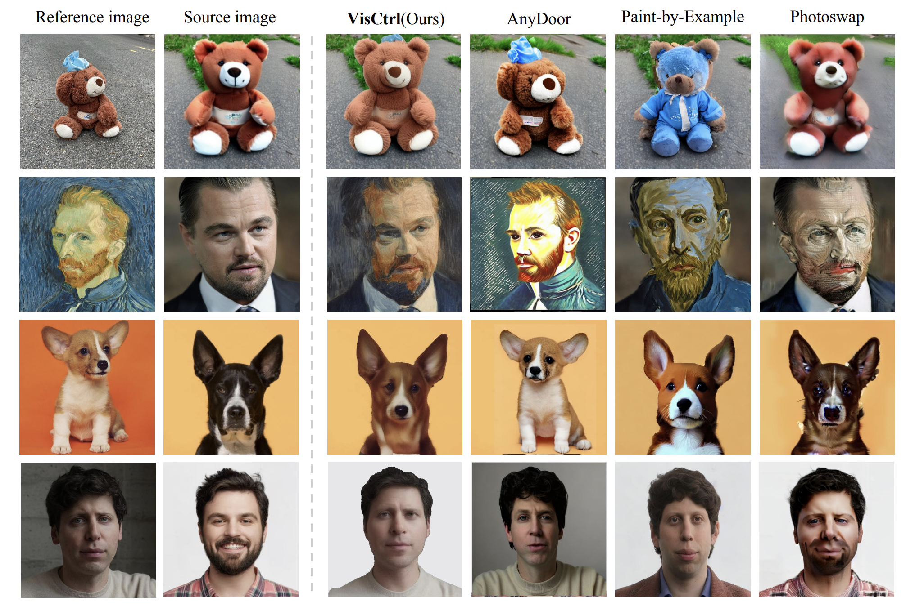

# VisCtrl

Pytorch implementation of [VisCtrl:Tuning-Free Visual Customization via View Iterative Self-Attention Control](https://arxiv.org/abs/2406.06258)


[Xiaojie Li](https://github.com/xjli360),
[Chenghao Gu](),
[Shuzhao Xie](https://shuzhaoxie.github.io/),
[Yunpeng Bai](https://scholar.google.com/citations?user=OJNkfm8AAAAJ&hl=zh-CN),
[Weixiang Zhang](),
[Zhi Wang](http://pages.mmlab.top/)




## Updates

- [coming soon...] Code released for 3d and video editing.
- [2024/6/27] Code released for image editing.
- [2024/6/10] Paper is available [here](https://arxiv.org/abs/2406.06258).

---

## Usage
### Requirements
We implement our method with [diffusers](https://github.com/huggingface/diffusers) code base with similar code structure to [Prompt-to-Prompt](https://github.com/google/prompt-to-prompt). The code runs on Python 3.8.5 with Pytorch 1.11. Conda environment is highly recommended.

```base
pip install -r requirements.txt
```

## Checkpoints

**Stable Diffusion:**
We mainly conduct expriemnts on Stable Diffusion v1-5. You can download these checkpoints on their official repository and [Hugging Face](https://huggingface.co/).

**SAM Models:**
The segmentation model used in the project is [LangSAM](https://github.com/luca-medeiros/lang-segment-anything), which allows using textual condition to segment images. Of course, you can also use [SAM](https://github.com/s-macke/SAM).


## Implement

```base
python image_inference.py --tar_prompt <tar_img_prompt> --ref_prompt <ref_img_prompt> --iteration_num <visctrl_iteration_num> --tar_img_path <tar_img_path> --tar_img_mask_path <tar_img_mask_path> --ref_img_path <ref_img_path> --ref_img_mask_path <ref_img_mask_path>
```


## BibTeX

```bibtex
@article{li2024tuningfree,
  title={Tuning-Free Visual Customization via View Iterative Self-Attention Control},
  author={Li, Xiaojie and Gu, Chenghao and Xie, Shuzhao and Bai, Yunpeng and Zhang, Weixiang and Wang, Zhi},
  journal={arXiv preprint arXiv:2406.06258},
  year={2024}
}
```

## Acknowledgments
This codebase borrows from [MasaCtrl](https://github.com/TencentARC/MasaCtrl) and [Prompt-to-Prompt](https://github.com/google/prompt-to-prompt). Thanks to the authors for releasing their codebases!
